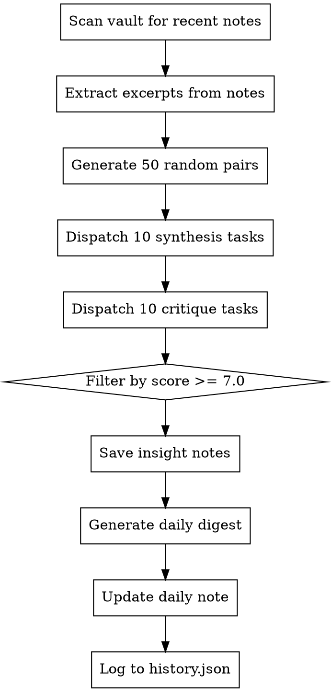

# Vault Daydream Skill

Multi-agent system that mines the Obsidian vault for non-obvious connections between notes, mimicking the brain's default mode network. Samples random note pairs, synthesizes connections, filters with critic.

Inspired by [Gwern's LLM Daydreaming](https://gwern.net/ai-daydreaming).

## Usage

```
/daydream
```

## What it does

1. Uses `asiye-obsidian/` as vault root
2. Scans vault for notes modified in last 120 days
3. Generates 50 recency-weighted random pairs
4. Synthesizes connections (parallel batches)
5. Critiques and scores insights (parallel batches)
6. Filters for quality (average score >= 7.0)
7. Saves insight notes to `Daydreams/` folder
8. Generates daily digest in `Daydreams/digests/`
9. Appends summary to today's daily note

## Output

- **Individual insights**: `Daydreams/YYYYMMDD-slug.md`
- **Daily digest**: `Daydreams/digests/YYYYMMDD-digest.md`
- **Daily note**: Summary appended under `## Daydream`
- **History log**: `ai-research/daydream/history.json`

## Architecture

```
Skill (orchestrator)
  |-- Glob/Read: scan vault, extract excerpts
  |-- Generate 50 random pairs (recency-weighted)
  |-- Task x 10: synthesize connections  <-- parallel
  |-- Task x 10: critique/score insights  <-- parallel
  |-- Filter (avg >= 7.0)
  +-- Write: save insight notes + daily digest
```

No external dependencies -- pure OpenCode tools (glob, read, write, bash, task, question).

## Checklist

You MUST create a task for each of these items and complete them in order:

1. **Scan vault** — use `glob` to find all `.md` files in `asiye-obsidian/`, filter by modification date (last 120 days)
2. **Extract excerpts** — read random samples from recent notes (use `read` with offset/limit for efficiency)
3. **Generate pairs** — create 50 recency-weighted random note pairs
4. **Synthesize connections** — dispatch 10 parallel `task` agents, each synthesizing 5 pairs into insights
5. **Critique & score** — dispatch 10 parallel `task` agents, each scoring 5 insights on novelty, usefulness, coherence (1-10 scale)
6. **Filter insights** — keep only insights with average score >= 7.0
7. **Save insights** — write individual insight notes to `Daydreams/YYYYMMDD-slug.md`
8. **Generate digest** — compile daily digest at `Daydreams/digests/YYYYMMDD-digest.md`
9. **Update daily note** — append summary under `## Daydream` section in today's daily note
10. **Log history** — append metadata to `ai-research/daydream/history.json`

## Process Flow



## Tool Substitutions

When executing this skill, use OpenCode native tools:
- `glob` — find note files in vault
- `read` — extract note content (use offset/limit for large files)
- `write` — save insights, digests, and history
- `bash` — run date filters, JSON manipulation, file operations
- `task` — dispatch parallel synthesis and critique agents
- `question` — confirm vault path or ask user about insight quality if needed

## Important Notes

- **Vault path**: Default is `asiye-obsidian/` relative to project root. Confirm with user if different.
- **Recency weighting**: Notes modified more recently should have higher probability of selection.
- **Parallel execution**: Synthesis and critique tasks should run in parallel batches for speed.
- **Quality filter**: Only insights scoring >= 7.0 average should be saved.
- **Idempotent**: Running multiple times on same day should append, not overwrite.
